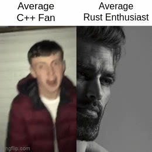

# Jackson Isenberg

A not-so-average Rust enthusiast. Here's my [resume](https://github.com/JIceberg/resume/blob/master/resume.pdf).

## Groups
Member of:
* [FTCLib](https://www.github.com/FTCLib) as the Lead Developer
* [Alpharetta Robotics](https://github.com/AHS-Robotics-Club) as the Head Mentor
* [RoboJackets](https://github.com/RoboJackets) as the IT Coordinator
* [HyTech Racing](https://github.com/hytech-racing)

## GitHub Stats

## Projects

<!--
**JIceberg/jiceberg** is a ✨ _special_ ✨ repository because its `README.md` (this file) appears on your GitHub profile.

Here are some ideas to get you started:

- 🔭 I’m currently working on ...
- 🌱 I’m currently learning ...
- 👯 I’m looking to collaborate on ...
- 🤔 I’m looking for help with ...
- 💬 Ask me about ...
- 📫 How to reach me: ...
- 😄 Pronouns: ...
- ⚡ Fun fact: ...
-->
